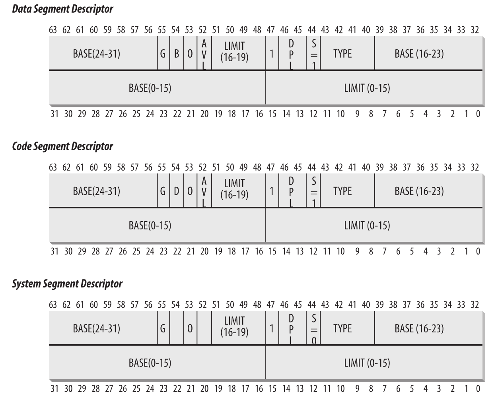

# 内存地址

现代计算机中，CPU + 一些电路硬件电路使得内存管理更有效、更健壮，因此操作系统不必跟踪物理内存使用。

三类内存地址：
- 逻辑地址(Logical address)：程序中指定指令或操作的地址，每个地址由段和偏移组成。
- 线性地址(Linear address，也称虚拟地址)：
- 物理地址(Physical address)：用于处理存储器芯片中的存储单元，对应处理器沿着地址总线发送到存储器总线的电信号

内存管理器单元(MMU)通过分段处理单元将逻辑地址转为线性地址，然后再通过页单元将线性地址转为物理地址。

```
              +----------+  线性地址    +----------+
逻辑地址 ---> | 分段单元 | ---------->  | 分页单元 | -----------> 物理地址
              +----------+              +----------+
```

在多处理器系统中，所有CPU可以共享统一块内存，这意味着RAM可以被多个CPU同时访问。因为读写必须同时进行，所以在RAM芯片和总线之间插入了内存仲裁器的电路，它的作用是当RAM空闲时候被CPU访问，当RAM正在被某个CPU访问时候禁止其他CPU访问。即使单CPU也许要内存仲裁器，因为DMA和CPU都需要访问RAM。多处理器系统中，仲裁器实现更加复杂。

## 硬件分段

从80286开始，Intel微处理器支持两种方式执行地址转换——实模式和保护模式。

实模式的存在主要是为了保持与旧处理器的兼容性，并使操作系统启动。

## 分段选择器和分段寄存器

逻辑地址分为两部分：一个段标识符和一个偏移量，指定该段内的相对地址。

段标识符是一个称为段选择器的16位字段，而偏移量是一个32位字段。

```
 15              3    2  1  0
+----------------+----+-----+
| index          | TI | RPL |
+----------------+----+-----+
```

为了编译快速检索段选择器，处理器提供了段寄存器，旨在保存段选择子，这些寄存器包括：CS, SS, DS, ES, FS, GS。

这六个段寄存器中，其中有三个段寄存器有特殊目的：
- CS: 代码段寄存器，指向代码段
- SS: 栈段寄存器，指向当前程序栈段
- DS: 数据段寄存器，指向包含全局数据和静态数据的数据段

其余三个寄存器是通用段寄存器。

CS 段寄存器包含2位权限位，指定CPU当前特权级别，0表示最高特权级别、3表示最低特权级别。

## 段描述符

每个部分由一个8字节的分段描述符表示，该描述符可以存储在全局描述符表(GDT)或本地描述符表(LDT)中。

通常只定义一个GDT，如果进程除了GDT外还需要创建额外的段，则可以拥有自己的LDT。

主存储器中GDT的地址和大小保存在gdtr寄存器中，当前使用的LDT的地址和大小保存在ldtr寄存器中。

段描述符字段

|字段名|描述|
|:-----|:---|
|Base|包含段的第一个字节的线性地址|
|G|粒度标志: 如果是0，段大小以字节表示，否则以4K字节的整数倍|
|Limit|保存段最后一个字节的偏移量，从而确定段的长度。<br/>当G设置为0时候，段长在1byte ~ 1MB之间;<br/>否则，段长在4KB ~ 4GB之间|
|S|系统标志: 如果置0表示本地描述符表；否则表示正常的代码段或数据段|
|TYPE|表示段类型以及访问权限|
|DPL|描述符特权级别: 用于限制对片段的访问。|
|P|段当前标志: 如果该段位存储到内存中，则置0；Linux通常设置此段为1，因此不会将此段交换到磁盘|
|D 或 B|D或B取决于此段是代码段还是数据段。|
|AVL|Linux忽略|

以下是Linux使用到的几种段类型。
- 代码段描述符：
- 数据段描述符：
- 任务段寄存器(TSSD)：
- 本地段描述符(LDTD)：

## 快速访问段描述符


