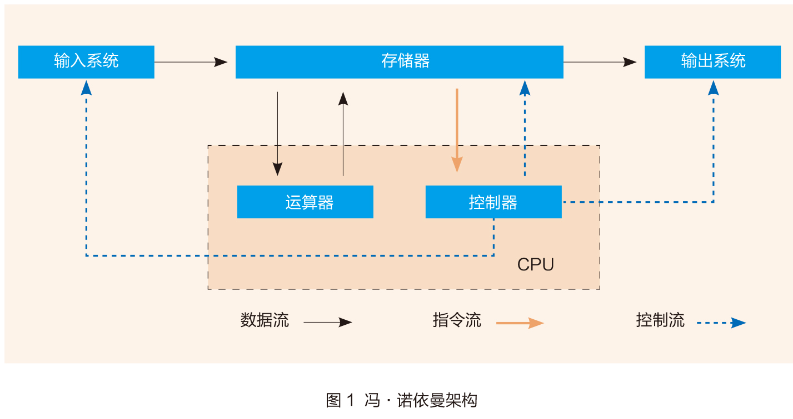

# 冯-诺伊曼结构

冯·诺依曼结构也称普林斯顿结构，是一种将程序指令存储器和数据存储器合并在一起的存储器结构。程序指令存储地址和数据存储地址指向同一个存储器的不同物理位置，因此程序指令和数据的宽度相同，如英特尔公司的8086中央处理器的程序指令和数据都是16位宽。

数学家冯·诺依曼提出了计算机制造的三个基本原则，即采用二进制逻辑、程序存储执行以及计算机由五个部分组成（运算器、控制器、存储器、输入设备、输出设备），这套理论被称为冯·诺依曼体系结构。

- 架构优势
	- 灵活性：硬件与程序解耦，支持软件升级和扩展。
	- 历史影响：奠定了现代计算机设计基础，至今仍广泛应用于通用计算领域。
- 冯·诺依曼瓶颈
	- 问题：数据传输速度远低于计算速度，导致处理器等待内存响应时效率低下，尤其在AI计算中尤为明显。
	- 解决方案：
		- 硬件优化：采用多级缓存（L1-L3）、近内存技术或存算一体架构。
		- 算法改进：如模拟内存计算（PCM）减少数据搬运能耗。

