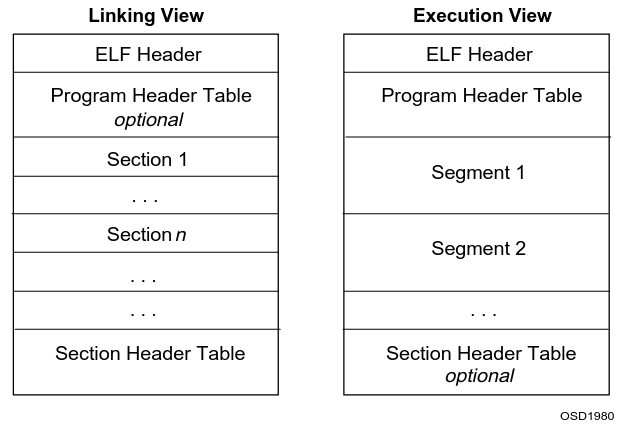
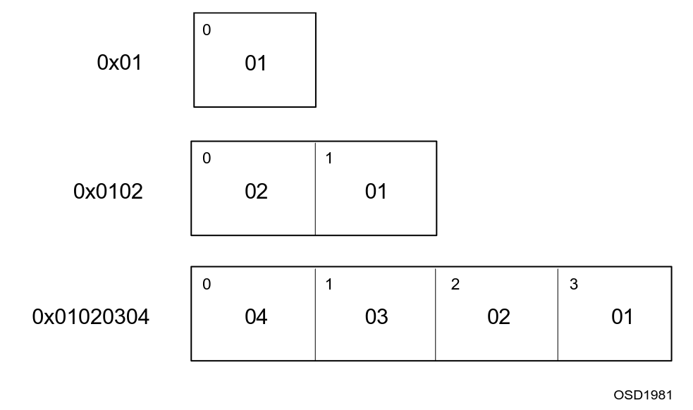
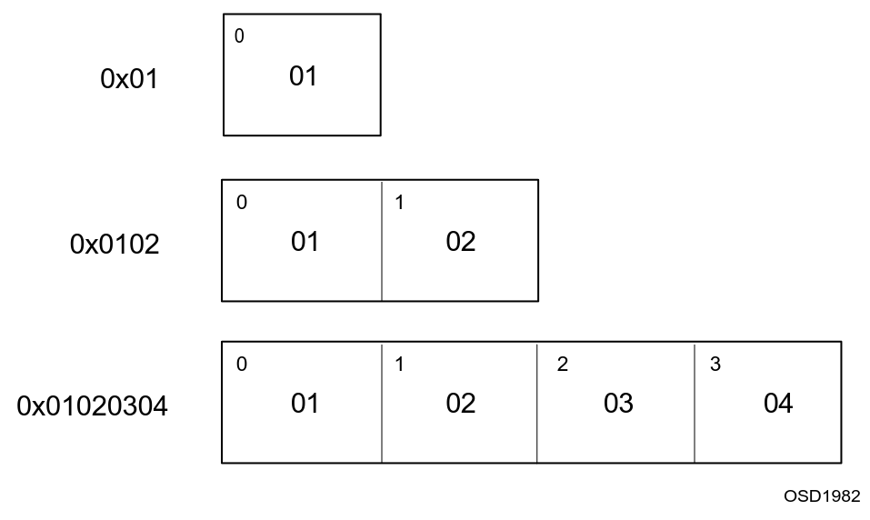

# 目标文件(Object Files)

目标文件主要有三种类型：
1. 可重定向文件：保存的代码和数据适合与其他目标文件链接，以创建可执行文件或共享目标文件。
2. 可执行文件保存适合执行的程序
3. 共享对象文件：保存适合在两个上下文中链接的代码和数据。首先连接器可以将它与其他可重定位和共享的目标文件一起处理，以创建另一个目标文件。其次，动态连接器将它与可执行文件和其他共享对象结合起来创建进程映像。

由汇编器和链接器创建的目标文件是打算直接在处理器上执行的程序的二进制表示形式。

## 文件格式



ELF头部信息保存着文件文件组织的“路线图”。section保存了链接视图中大量对象文件信息：指令、数据、符号表、重定位信息等。特殊部分的描述将在后续描述。

程序头表（如果存在）告诉系统如何创建进程映像。用来建立进程映像（执行程序）的文件必须有一个程序头表；可靠定位文件不需要。节头表包含描述文件节的信息。每个section在表中都有一个条目；每个条目提供诸如节名、节大小等信息。链接过程中使用的文件必须有一个section头表；其他目标文件可能有，也可能没有。

> 注意：尽管图中显示的是紧跟在ELF头之后的程序头表，以及紧跟在节之后的节头表，但实际文件可能有所不同。此外，节和段没有指定的顺序。只有ELF头在文件中有固定的位置。

## 数据表示

如本文所述，对象文件格式支持具有8位字节和32位架构的各种处理器。然而，它的目的是可扩展到更大（或更小）的体系结构。因此，目标文件用一种与机器无关的格式表示一些控制数据，从而可以用一种通用的方式识别目标文件并解释其内容。目标文件中的其余数据使用目标处理器的编码，而不管在哪个机器上创建该文件。

|Name|Size|Alignment|
|:---|:---|:--------|
|`Elf32_Addr`|4|4|
|`Elf32_Half`|2|2|
|`Elf32_Off`|4|4|
|`Elf32_Sword`|4|4|
|`Elf32_Word`|4|4|
|`unsigned char`|1|1|

对象文件格式定义的所有数据结构都遵循相关类的“自然”大小和对齐准则。如果有必要，数据结构包含显式填充，以确保4字节对象的4字节对齐，强制结构大小为4的倍数，等等。数据从文件的开头也有何时的对齐方式。因此，例如，包含`Elf32_Addr`成员的结构将在文件内按4字节边界对齐。

处于可移植性的考虑，ELF不使用位字段。

## 字符表示

接下来描述默认的ELF字符表示，并定义用于应该在系统之间可移植的外部文件的标准字符集。几种外部文件格式用字符表示控制信息。这些单字节字符使用7位ASCII字符集。换句话说，当ELF接口文档提到字符常量时，例如'/'或'\n'，它们的数值应该遵循7位ASCII准则。

对于前面的字符常量，单字节值将分别为47和10。

根据字符编码的不同，0~127以外的字符集可能占用一个或多个字节。应用程序可以控制自己的字符集，为不同的语言使用不同的字符集扩展。虽然符合tis并不限制字符集，但它们通常应该遵循一些简单的指导方针。
- 0~127之间的字符值对应7位ASCII码。也就是说，编码大于127的字符集应该包括7位ASCII码作为子集。
- 大于127的多字节字符编码只能包含0到127范围之外的字节。也就是说，每个字符使用一个以上字节的字符集不应该在多字节的非ASCII字符中“嵌入”类似于7位ASCII字符的字节。
- 多字节字符应该是自识别的。例如，它允许在任何多字节字符对之间插入任何多字节字符，而不改变字符的解释。

这些注意事项与多语言应用程序特别相关。

> 注意：对于制定了处理器范围的ELF常量，有一些命名约定。对于处理器特定的扩展，诸如`DT_`，`PT_`之类的名称包含处理器的名称：例如，`DT_M32_SPECIAL`。但是，不使用此约定的已有处理器扩展将得到支持。

## ELF Header

一些目标文件控制结构可以增长，因为ELF头文件包含了它们的实际大小。如果目标文件格式改变，程序可能会遇到比预期更大或更小的控制结构。因此程序可能会忽略“额外”的信息。对“缺失”信息的处理决定于上下文，并将在定义扩展时指定。

```c
#define EI_NIDENT               16

typedef struct 
{
    unsigned char   e_ident[EI_NIDENT];
    Elf32_Half      e_type;
    Elf32_Half      e_machine;
    Elf32_Word      e_version;
    Elf32_Addr      e_entry;
    Elf32_Off       e_phoff;
    Elf32_Off       e_shoff;
    Elf32_Word      e_flags;
    Elf32_Half      e_ehsize;
    Elf32_Half      e_phentsize;
    Elf32_Half      e_phnum;
    Elf32_Half      e_shentsize;
    Elf32_Half      e_shnum;
    Elf32_Half      e_shstrndx;
} Elf32_Ehdr;
```
### `e_ident`
初始字节将文件标记为目标文件，并提供与机器无关的数据，用于解码和解释文件的内容。完整的描述减下面的"ELF Identification"

|Name|Value|Purpose|
|:---|:----|:------|
|`EI_MAG0`|0|File Identification|
|`EI_MAG1`|1|File Identification|
|`EI_MAG2`|2|File Identification|
|`EI_MAG3`|3|File Identification|
|`EI_CLASS`|4|File class|
|`EI_DATA`|5|Data encoding|
|`EI_VERSION`|6|File version|
|`EI_PAD`|7|Start of padding bytes|
|`EI_NIDENT`|16|SIze of `e_ident[]`|

这些索引访问保存以下值的字节。

`EI_MAG0`到`EI_MAG3`文件的前4个字节包含一个“幻数”，将该文件标识为ELF对象文件。
|Name|Value|Meaning|
|:---|:----|:------|
|`ELFMAG0`|`0x7f`|`e_ident[EI_MAG0]`|
|`ELFMAG1`|`E`|`e_ident[EI_MAG1]`|
|`ELFMAG2`|`L`|`e_ident[EI_MAG2]`|
|`ELFMAG3`|`F`|`e_ident[EI_MAG3]`|

`EI_CLASS`: 下一个字节`e_ident[EI_CLASS]`标识文件的类或容量。

|Name|Value|Meaning|
|:---|:----|:------|
|`ELFCLASSNONE`|0|Invalid class|
|`ELFCLASS32`|1|32-bit objects|
|`ELFCLASS64`|2|64-bit objects|

这种文件格式被设计成可以在不同大小的机器之间便携，而不会把最大的机器的大小强加给最小的机器。类ELFCLASS32支持机器的文件和虚拟地址空间高达4千兆字节；它使用上面定义的基本类型。

类ELFCLASS64是不完整的，它指的是64位体系结构。它在这里的出现显示了目标文件可能发生的变化。其他类将根据需要定义，具有不同的基本类型和对象文件数据的大小。

`EI_DATA`: Byte `e_ident[EI_DATA]`指定对象文件中特定于处理器的数据的数据编码。目前定义了以下编码。
|Name|Vaule|Meaning|
|:---|:----|:------|
|ELFDATANONE|0|Invalid data encoding|
|ELFDATA2LSB|1|See below|
|ELFDATA2MSB|2|See below|

关于这些编码的更多信息如下所示。其他值被保留，并在必要时分配给新的编码。

`EI_VERSION`: Byte `e_ident[EI_VERSION]`指定ELF报头版本号。目前，这个值必须是`EV_CURRENT`，如上`e_version`的解释。

`EI_PAD`: 该值标志着`e_ident`中未使用字节的开始。这些字节被保留并设置为零；读取目标文件的程序应该忽略它们。如果当前未使用的字节被赋予含义，`EI_PAD`的值将来会改变。

文件的数据编码指定了如何解释文件中的基本对象。如上所述，`ELFCLASS32`类文件使用占用1、2和4字节的对象。在定义的编码下，对象表示如下所示。字节数出现在左上角。

编码`ELFDATA2LSB`指定2的补码值，最低有效字节占用最低地址。


### `e_type`:
该成员表示对象文件类型

|Name|Value|Meaning|
|:---|:----|:------|
|`ET_NONE`|0|无文件类型|
|`ET_REL`|1|可重定向文件|
|`ET_EXEC`|2|可执行文件|
|`ET_DYN`|3|共享对象文件|
|`ET_CORE`|4|core文件|
|`ET_LOPROC`|0xff00|Processor-specific|
|`ET_HIPROC`|0xffff|Processor-specific|

虽然core文件内容未指定，但保留`ET_CORE`类型来标记文件类型。从`ET_LOPROC`到`ET_HIPROC`（包括`ET_HIPROC`）的值为特定于处理器的语义保留。其他值被保留，并在必要时分配给新的目标文件类型。

### `e_machine`

此成员的值指定单个文件所需的体系结构。

|Name|Value|Meaning|
|:---|:----|:------|
|`ET_NONE`|0|无体系结构|
|`EM_M32`|1|AT&T WE 32100|
|`EM_SPARC`|2|SPARC|
|`EM_386`|3|Intel结构|
|`EM_68K`|4|Motorola 68000|
|`EM_88K`|5|Motorola 88000|
|`EM_860`|7|Intel 80860|
|`EM_MIPS`|8|MIPS RS3000 Big-Endian|
|`EM_MIPS_RS4_BE`|10|MIPS RS4000 Big-Endian|
|`RESERVED`|11-16|Reserved for future use|

其他值将保留，并在必要时分配给新机器。特定于处理器的ELF名称使用机器名称来区分它们。例如，下面提到的标志使用前缀`EF_`；`EM_XYZ`机器的一个名为`WIDGET`的标志将被称为`EF_XYZ_WIDGET`。

### `e_version`

该成员标识目标文件的版本。

|Name|Value|Meaning|
|`EV_NONE`|0|Invalid version|
|`EV_CURRENT`|1|Current version|

值1表示原始文件格式；扩展将创建具有更高编号的新版本。`EV_CURRENT`的值，虽然如上所述为1，但将根据需要更改以反映当前版本号。

### `e_entry`

该成员提供了虚拟地址，系统首先将控制权传递给该地址，从而启动进程。如果文件没有关联的入口点，则该成员为0。

### `e_phoff`

该成员保存程序头表的文件偏移量（以字节为单位）。如果文件没有程序头表，则该成员为零。

### `e_shoff`

该成员保存section头表的文件偏移量（以字节为单位）。如果文件没有section头表，则该成员为零。

### `e_flags`

此成员保存与文件关联的特定于处理器的标志。标志名采用`EF_machine_flag`的形式。

### `e_ehsize`

这个成员保存ELF报头的字节大小。

### `e_phentsize`

这个成员保存着文件的程序头表中一个表项的字节大小；所以有条目的大小相同。

### `e_phnum`

该成员保存程序头表中的表项数。因此`e_phentsize`和`e_phnum`的乘积给出了表的大小（以字节为单位）。如果文件没有程序头表，`e_phnum`的值为0。

### `e_shentsize`

这个成员保存着section头的大小（以字节为单位）。section头是section头表中的一个条目；所有条目的大小相同。

### `e_shnum`

该成员保存section头表中的表项数。因此`e_shentsize`和`e_shnum`的乘积给出了section头表的字节大小。如果文件没有section头表，`e_shnum`的值为0。

### `e_shstrndx`

该成员保存与section name字符串表相关联的section头表索引。如果文件没有section名称字符串表，该成员保存值`SHN_UNDEF`。


#### Data Encoding (ELFDATA2LSB)

编码ELFDATA2MSB指定2的补码值，最高位字节占用最低位址。



#### Data Encoding (ELFDATA2MSB)



## Sections

一个object文件的section头表允许我们定位文件的所有section。section头表是一个`Elf32_Shdr`结构的数组，如下所述。section头表索引是这个数组的下标。ELF头的`e_shoff`成员给出了从文件开头到section头表的字节偏移量；`E_shnum`表示section头表包含多少项；`e_shentsize`以字节为单位给出每个条目的大小。

一些section头表索引是保留的；一个object文件不会有这些特殊索引的节

### Special Section Indexes

|Name|Value|Meaning|
|:---|:----|:----|
|`SHN_UNDEF`|0|该值表示未定义、缺失、不相关或无意义的节引用。例如，一个符号“defined ”相对于section号`SHN_UNDEF`是一个未定义的符号|
|`SHN_LORESERVE`|0xff00|此值指定保留索引范围的下限|
|`SHN_LOPROC`|0xff00|此范围内的值保留用于特定于处理器的语义|
|`SHN_HIPROC`|0xff1f|此范围内的值保留用于特定于处理器的语义|
|`SHN_ABS`|0xfff1|此值指定相应引用的绝对值。例如，相对于section号`SHN_ABS`定义的符号具有绝对值，并且不受重定位的影响|
|`SHN_COMMON`|0xfff2|相对于本节定义的符号是通用符号，如FORTRAN common或未分配的C外部变量|
|`SHN_HIRESERVE`|0xffff|此值指定保留索引范围的上界。系统预留索引在SHN_LORESERVE和SHN_HIRESERVE之间，包括；这些值不引用节头表。也就是说，section头表不包含保留索引的条目|

节包含了一个目标文件中的所有信息，除了ELF头、程序头表和节头表。此外，目标文件的节满足几个条件：
- object文件中的每个节都有一个描述它的节头。可能存在没有节的节头
- 每个节占用文件中一个连续的（可能为空的）字节序列
- 一个文件中的节不能重叠。文件中的字节不能驻留在多个节中
- 目标文件可能具有非活动空间。不同的头和节可能不会“覆盖”目标文件中的每个字节。未指定非活动数据的内容

节头具有以下结构：
```c
typedef struct
{
    Elf32_Word      sh_name;
    Elf32_Word      sh_type;
    Elf32_Word      sh_flags;
    Elf32_Addr      sh_addr;
    Elf32_Off       sh_offset;
    Elf32_Word      sh_size;
    Elf32_Word      sh_link;
    Elf32_Word      sh_info;
    Elf32_Word      sh_addralign;
    Elf32_Word      sh_entsize;
} Elf32_Shdr;
```


