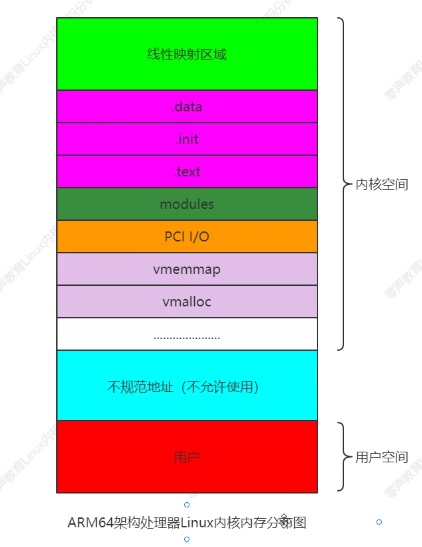
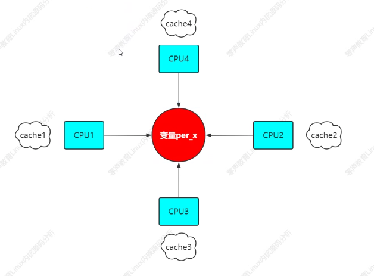

# 内核内存布局和堆管理

64位Linux一般使用48位表示虚拟地址空间，45位表示物理地址。

## 内存布局
### cpuinfo

通过 cat /proc/cpuinfo 输出地址大小等信息：
- 内核启动时候测算的CPU速度：`bogomips	: 6376.00`
- 梅酢刷新缓存的大小单位：`clflush size	: 64`
- 缓存地址空间的对齐单位：`cache_alignment	: 64`
- 可以访问地址空间的位数：`address sizes	: 46 bits physical, 48 bits virtual`

### meminfo

通过 cat /proc/meminfo 查看地址分布情况：


内核如何动态分配：
- `alloc_pages/__get_free_page`: 以页为单位分配
- `vmalloc`：以字节位单位分配虚拟地址连续的内存块。grep vmalloc /proc/vmallocinfo
- `kmalloc`：以字节为单位分配物理地址连续的内存块，它是以slab位中心

ARM64采用48位物理寻址方式，最大可寻址256TB的物理地址空间。对于目前应用完全足够，不需要扩展到64位。虚拟地址同样支持最大48位寻址。Linux内核在大多数体系结构上将地址空间化为：用户空间和内核空间。

ARM64内核/用户地址空间划分
```
+-----------------------------------+
| 内核空间                          |
+-----------------------------------+
| 不规范地址空间（不许使用）        |
+-----------------------------------+
| 用户地址空间                      |
+-----------------------------------+
```



- KASAN（影子区）：动态检测内存错误的工具，利用额外的内存标记可用内存的状态。一般将八分之一内存作为影子区
- modules：128MB的内存模块区，是内核模块使用的虚拟地址空间
- vmalloc：vmalloc函数使用的虚拟地址空间
- `.text`：代码段
- `.init`：模块初始化数据
- `.data`：数据段，内核初始化的全局数据都在这里
- `.bss`：静态内存分配段（未初始化、初始化为0的静态全局变量）
- `fixed`：固定映射区域
- `pci`：针对PCI设备的I/O地址空间
- `vmemmap`：内存的物理地址如果不连续的化，就会存在内存空洞（稀疏内存），vmemmap就用来存放稀疏内存的page结构体的数据的虚拟地址空间
- `memory`：线性映射区域，显示实际访问的内存区域，可以通过内存布局打印出来

arm Vexpress平台可以看内存布局


## 堆管理

堆是进程中主要用于动态分配变量和数据的内存区域，堆的管理对应程序员不是直接可见的。malloc和内核之间的经典接口是brk系统调用，负责扩展/收缩堆。

堆是一个连续的内存区域，在扩展时候自下向上增长，其中mem_struct结构，包含堆在虚拟地址空间中的起始和当前结束地址（start_brk和brk）


include/linux/mm_types.h

### linux堆创建

1. brk系统调用指定堆在虚拟地址空间中新的结束地址（如果堆将要收缩，当然可以小于当前值）。brk系统调用动态分配，具体查看 brk 函数。
2. mmap()向操作系统申请一段虚拟地址空间（使用映射到某个文件）。当不用此空间来映射到某个文件时候，这块空间称为匿名空间作为堆空间。 

### per-CPU计数器

引入它来加速SMP系统上计数器操作

include/linux/percpu_counter.h



