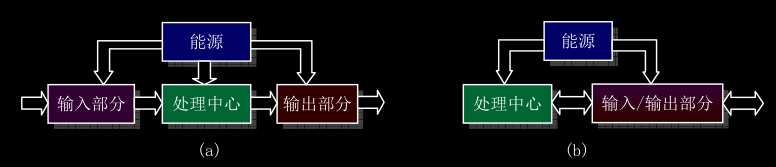
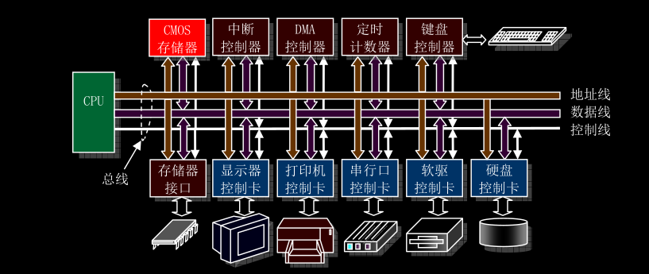
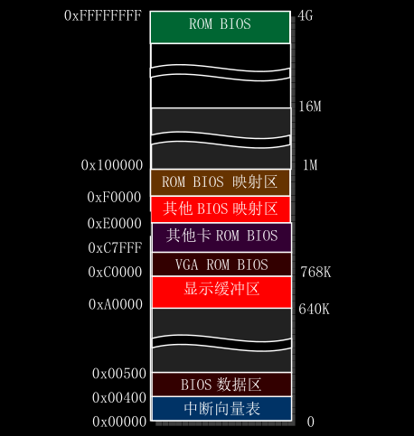
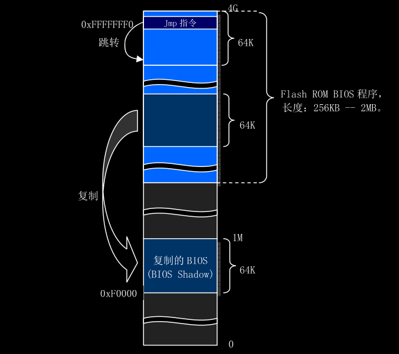
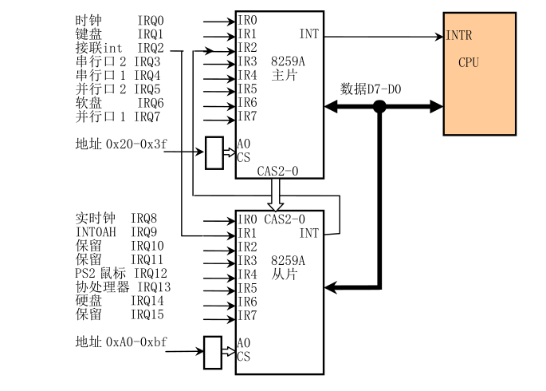

# 计算机组成结构

系统基础组成部分：
- 输入部分
- 输出部分
- 处理中心
- 能源

计算机系统可以分为硬件部分和软件部分，两者之间相互依存。硬件部分是计算机系统的可见部分，是软件运行和存储的平台。软件部分是一种控制硬件操作和动作的指令流。本章描述的主题就是一个计算机系统的运行机制，主要说明系统的处理中心和输入/输出部分的硬件组成原理和软件控制的实现。

## 微型计算机组成原理

一个传统微型计算机硬件组成结构如下图所示。其中，CPU通过地址线、数据线和控制信号线组成的本地总线(或称为内部总线)与系统其他部分进行数据通信。

- 地址线用于提供内存或I/O设备的地址，即指明需要读/写数据的具体位置。
- 数据线用于在CPU和内存与I/O设备之间提供数据传输的通道
- 控制线则负责指挥执行的具体读/写操作。

对于使用80386 CPU 的 PC 机，其内部地址线和数据线分别有32根，即都是32位的。因此地址寻址空间范围有 `2^32` 字节，从 0 到 4GB。

图中上部控制器和存储器接口通常都集成在计算机主板上，这些控制器分别都是以一块大规模集成电路芯片为主组成的功能电路。例如，中断控制器由Intel 8259A或兼容的芯片构成DMA控制器通常采用Intel8237A芯片构成来定时计数器则是Intel 8253/8254定时芯片；键盘控制器使用的是Intel 8042芯片来与键盘中的扫描电路进行通信。

图中下方的控制卡(或者称为适配器)则是通过扩展插槽与主板上系统总线连接。总线插槽是系统地址总线、数据总线和控制线的与扩展设备控制器的标准连接接口。这些接口标准通常有ISA(工业标准结构, Industry Standard Architecture)总线、AGP(加速图形端口, Extented ISA)总线、PCI(外围组件互连)总线等。这些总线接口的主要区别在于数据传输速率和控制灵活性方面。随着计算机硬件的发展，传输速率更高、控制更灵活的总线接口还在不断推出，例如采用串行通信点对点技术的告诉PCIE(PCI Express)总线。最初的80386机器上只有ISA总线，因此系统与外部I/O设备最多只能使用16位数据线进行数据传输。

## I/O端口寻址和访问控制方式

### I/O端口和寻址

CPU为了访问I/O接口控制器或控制卡上的数据和状态信息，需要首先指定它们的地址，这种地址就成为I/O端口地址或者简称端口。通常一个I/O控制器包含访问数据的数据端口、输出命令的命令端口和访问控制器执行状态的状态端口。端口地址的设置方法一般有两种：统一编址和独立编址。

端口统一编址的原理是把I/O控制器中的端口地址归入存储器寻址地址空间范围内。因此这种编址方式也称为存储控制器映像编址。CPU访问一个端口的操作与访问内存的操作一样，也使用访问内存的指令。

端口独立编址的方法是把I/O控制器和控制卡的寻址空间单独作为一个独立的地址空间对待，称为I/O地址空间。每个端口有一个I/O地址与之对应，并且使用专门的I/O指令来访问端口。

### 接口访问控制

PC机I/O接口数据传输控制方式一般可采用程序循环查询方式、中断处理方式和DMA传输方式。顾名思义，循环查询方式是指CPU通过在程序中循环查询指定设备控制器中的状态来判断是否可以与设备进行数据交换。这种方式不需要过多硬件支持，使用和编程都比较简单，但是特别耗费CPU宝贵事件。因此在多任务操作系统中除非等待时间极短或必须，否则就不应该使用这种方式。在Linux操作系统中，只有在设备或控制器能够立即返回信息时才会在很少的几个地方采用这种方式。

中断处理控制方式需要有中断控制器的支持。在这种控制方式下，只有I/O设备通过中断向CPU提出处理请求时，CPU才会暂时中断当前执行的程序转而去执行相应的I/O中断处理服务过程。当执行完该中断处理服务过程后，CPU又会继续执行刚才被中断的程序。在I/O控制器或设备发出中断请求时，CPU通过使用中断向量表来寻址相应的中断处理服务过程的入口地址。因此采用中断控制方式时需要首先设置好中断向量表，并编制好相应的中断处理服务过程。Linux操作系统中大多数设备I/O控制都采用中断处理方式。

直接存储访问DMA方式用于I/O设备与系统内存之间进行批量数据传送，整个操作过程需要使用专门的DMA控制器来进行而无须CPU插手。由于在传输过程中无须软件介入，因此操作效率很高。在Linux操作系统中，软盘驱动程序使用中断和DMA方式配合来实现数据的传输工作。

## 主存储器、BIOS和CMOS存储器

### 主存储器

1981年IBM PC刚推出时候系统只带有640KB的RAM主存储器(简称内存)。由于所采用的 8088/8086 CPU只有20根地址线，因此内存寻址范围最高为 1024KB(1MB)。随着计算机软硬件技术的高速发展，出现了Intel 32位CPU，因此CPU的物理内存地址范围已经高达4GB。但是为了与原来PC机在软件上兼容，系统1MB以下物理内存使用分配上仍然保持与原来的PC机基本一致，指示原来系统ROM中的基本输入输出程序BIOS一直处于CPU能寻址的内存最高端位置处，而BIOS原来所在的位置将在计算机开机初始化时候被用作BIOS影子区域，即BIOS代码仍然会被复制到这个区域中。

当计算机上电初始化时，物理内存被设置成从地址0开始的连续区域。除了地址从 0xA0000 到 0xFFFFF(640K到1M共384K)和0xFFFE0000到0xFFFFFFFF(4G处的最后一64K)范围以外的所有内存都可用作系统内存。这两个特定范围被用于I/O设备和BIOS程序。假如我们的计算机中有16MB的物理内存，那么在Linux0.1x系统个中，0-640K将被用作存放内核代码和数据。Linux内核不使用BIOS功能，也不使用BIOS设置的中断向量表。640K-1M之间的384K仍然保留用作图中指明的用途。其中地址0xA0000开始的128K用作显示内存缓存区，随后部分用于其他控制卡的ROM BIOS或其映射区域，而0xF0000到1M范围用于高端系统ROM BIOS的映射区。1M-16M将被内核用于作为可分配的主内存区。另外高速缓存区和内存虚拟盘也会占用内核代码和数据后面的一部分内存区域，该区域通常会跨越640K-1M的区域。

### 基本输入/输出程序BIOS

存放在ROM中的系统BIOS程序主要用于计算机开机时候执行系统各个部分自检，建立起操作系统需要使用的各种配置表，例如中断向量表、硬盘参数表。并且把处理器和系统其余部分初始化到一个已知状态，而且还为DOS等操作系统提供硬件设备接口服务。但是由于BIOS提供的这些服务不具备可重入性(即其中程序不可并发运行)，并且从访问效率方面考虑，因此除了在初始化时候会利用BIOS提供一些系统参数以外，Linux操作系统在运行时候并不使用BIOS中的功能。

当计算机系统上电开机时，CPU会自动把代码段寄存器CS设置为 0xF000, 其段基地址则被设置为 0xFFFF0000，段长度设置为64KB。而IP被设置为0xFFF0, 因此此时CPU代码指针指向0xFFFFFFF0处，即4G空间最后一个64K的最后16字节处。由上图克制，这里正是系统 ROM BIOS 存放的位置。并且BIOS会在这里存放一条跳转指令JMP跳转到BIOS代码中64KB范围内的某一条指令开始执行。并且目前PC/AT微机中BIOS容量大多有1MB到2MB，并存储在闪存ROM中，因此为了能够执行或访问BIOS中超过64KB范围并且又远远不在0-1M地址空间中的其他BIOS代码或数据，BIOS程序会首先使用一种称为32位大模式技术把数据段寄存器的访问范围设置成4G(而非原来的64K), 这样就可以在0到4G范围内执行和操作数据。此后，BIOS在执行了一系列硬件检测和初始化操作之后，就会把与原来PC机兼容的64KB BIOS代码和数据复制到内存低端1M末端的64K处，然后跳转到这个地方并且让CPU进入真正的是地址模式工作。最后BIOS就会从硬盘或其他块设备把操作系统引导程序加载到内存0x7C00处，并跳转到这个地方继续执行引导程序。

### CMOS存储器

在 PC/AT 机器中，除了需要使用内存和ROM BIOS 以外，还使用只有很少存储容量(只有64或128字节)CMOS存储器来存放计算机中实时时钟信息和系统硬件配置信息。这部分内存通常和实时时钟芯片做在一块集成块中。CMOS内存的地址空间在基础内存地址空间之外，需要使用I/O指令来访问。

## 控制器和控制卡

### 中断控制器

IBM PC/AT 80x86 兼容微机使用两片级联的8259A可编程中断控制芯片组成一个中断控制器，用于实现I/O设备的中断控制数据存储方式，并且能为15个设备提供独立的中断控制功能，在计算机刚开机初始化期间，ROM BIOS 会分别对两片8259A芯片进行初始化，并分别把15级中断优先级分配给时钟定时器、键盘、串行口、打印口、软盘控制、协处理器和硬盘等设备或控制器使用。同时在内存开始处0x000-0xFFF区域建立一个中断向量表。但是由于这些设置违背了Intel公司的要求，因此Linux操作系统在内存初始化期间又重新对8259A进行了设置。

当一台PC计算器刚上电开机时候，上图中的硬件中断请求号会被ROM BIOS设置成对应中断向量号。Linux操作系统并不直接使用这些PC机默认设置好的中断向量号，当Linux系统执行初始化操作时候，它会重新设置中断请求号与中断向量号的对应关系。

|中断请求号|BIOS设置的中断号|用途|
|:---------|:---------------|:---|
|IRQ0|0x08(8)|8253发出的100HZ时钟中断|
|IRQ1|0x09(9)|键盘中断|
|IRQ2|0x0A(10)|接连从芯片|
|IRQ3|0x0B(11)|串行口2|
|IRQ4|0x0C(12)|串行口1|
|IRQ5|0x0D(13)|并行口2|
|IRQ6|0x0E(14)|软盘驱动器|
|IRQ7|0x0F(15)|并行口1|
|IRQ8|0x70(112)|实时时钟中断|
|IRQ9|0x71(113)|改向至INT 0x0A|
|IRQ10|0x72(114)|保留|
|IRQ11|0x73(115)|保留(网络接口)|
|IRQ12|0x74(116)|ps/2鼠标口中断|
|IRQ13|0x75(117)|数学协处理器中断|
|IRQ14|0x76(118)|硬盘中断|
|IRQ15|0x77(119)|保留|

### DMA控制器

如前所述，DMA控制器
