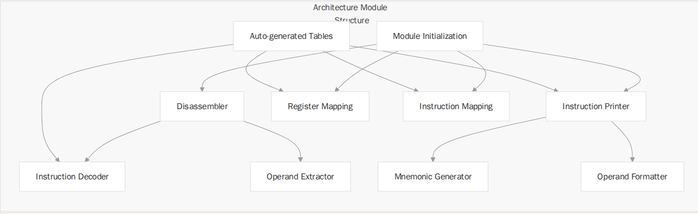

# capstone 设计

本页面介绍了Capstone反汇编引擎的整体架构、核心组件以及它们如何协同工作，将机器码转换为可读的汇编语言。

Capstone 采用模块化设计，核心引擎、架构特定模块与 API 层之间实现明确分离。此设计可轻松支持新增 CPU 架构，同时确保所有支持架构下 API 的一致性。

## 核心组件

核心引擎是Capstone的核心组件，负责管理拆解过程。其职责包括：
- 初始化架构特定模块
- 管理内存分配
- 协调反汇编过程
- 在所有架构上提供统一的API

每个受支持的 CPU 架构都有其专用的模块，用于实现该架构特有的反汇编逻辑。这些模块设计为插件，可以注册到核心引擎中。



## API 层

API 层为应用程序与 Capstone 进行交互提供了统一的接口。主要 API 功能包括：
- cs_open()：初始化反汇编句柄
- cs_disasm()：反汇编二进制代码
- cs_option()：设置反汇编选项
- cs_close()：清理并释放资源

该 API 设计简洁、一致且易于在所有支持的架构上使用。

## 配置

Capstone 提供了一个灵活的配置系统，支持构建时和运行时选项。

### 构建时配置

构建时配置选项允许根据不同使用场景对库进行定制：


|Option|Description|Configuration Variable|
|:-----|:----------|:---------------------|
|Architecture Selection| Enable/disable specific CPU architectures|CAPSTONE_ARCHS|
|Diet Mode| Reduce size by removing non-essential information|CAPSTONE_DIET|
|X86 Reduce| Remove non-critical X86 instruction sets|CAPSTONE_X86_REDUCE|
|System Memory| Use system memory management|CAPSTONE_USE_SYS_DYN_MEM|
|Static/Shared Library | Build as static or shared library|CAPSTONE_STATIC, CAPSTONE_SHARED|

### 运行时配置

|Option|Description|Option Type|
|:-----|:----------|:----------|
|Syntax|Assembly output syntax (Intel, AT&T, etc.)|CS_OPT_SYNTAX|
|Detail|Enable/disable detailed instruction info|CS_OPT_DETAIL|
|Mode|Architecture mode (32-bit, 64-bit, etc.)|CS_OPT_MODE|
|Memory Management|Custom memory allocation functions|CS_OPT_MEM|
|Skip Data|How to handle non-instruction data|CS_OPT_SKIPDATA|
|Mnemonic|Customize instruction mnemonics|CS_OPT_MNEMONIC|

### 模块深度解析

Capstone 中的每个架构模块都采用类似的结构，并通过一组标准化的函数和回调与核心引擎进行交互。

#### 模块注册

```c
typedef struct cs_arch_config 
{
    cs_err (*arch_init)(cs_struct *);       // Initializer function
    cs_err (*arch_option)(cs_struct *, cs_opt_type, size_t value); // Option handler
    cs_mode arch_disallowed_mode_mask;      // Disallowed modes
} cs_arch_config;
```
该结构体包含用于架构特定初始化和选项处理的函数指针，以及一个禁止模式的掩码。

### 架构特定组件

每个架构模块通常包含以下组件：
1. 反汇编器：将机器码转换为内部表示形式
2. 指令打印器：将内部表示形式转换为汇编文本
3. 映射：在指令ID、寄存器ID及其名称之间建立映射关系
4. 模块：初始化及选项处理代码
5. 生成的表格：自动生成的指令信息表格

例如，X86架构模块包括：
- X86Disassembler.c：X86 反汇编实现
- X86IntelInstPrinter.c：Intel 语法打印器
- X86ATTInstPrinter.c：AT&T 语法打印器
- X86Mapping.c：指令和寄存器映射
- X86Module.c：模块初始化和选项
- 各种自动生成的表格（.inc 文件）

## 架构特性

每种架构支持不同的模式和功能。以下是关于最常用的架构的详细信息。

### x86架构

x86架构是Capstone中最为复杂且功能丰富的架构之一。

#### 支持的模式

- 16-bit mode (CS_MODE_16)
- 32-bit mode (CS_MODE_32)
- 64-bit mode (CS_MODE_64)

#### 特殊功能：

- 多种语法选项（Intel、AT&T 和 MASM）
- 精简模式以减小内存占用（CAPSTONE_X86_REDUCE）
- 详细操作数信息（寄存器、内存引用、立即数）

x86 架构模块包含专门用于解码复杂指令、处理不同寻址模式以及管理大型指令集的专用组件。

### ARM架构

ARM 架构支持包括标准 ARM 模式和 Thumb 模式。

支持的模式：
- ARM 模式 (CS_MODE_ARM)
- Thumb 模式 (CS_MODE_THUMB)
- ARM v8-A (CS_MODE_V8)
- Cortex-M 系列 (CS_MODE_MCLASS)
- 两种字节序（默认小端序，CS_MODE_BIG_ENDIAN 用于大端序）

特殊功能：
- 条件执行
- 详细操作数信息（包括移位操作）
- 寄存器别名支持
- ARM 架构模块处理复杂的指令编码以及 ARM 和 Thumb 模式下可用的不同指令集。

### AArch64架构

AArch64 是随 ARMv8 架构推出的 64 位 ARM 架构。

#### 支持的模式

- ARM 模式（CS_MODE_ARM）
- 两种字节序选项

#### 特殊功能

- 高级 SIMD 指令
- SVE（可扩展向量扩展）支持
- 系统寄存器和指令

AArch64 模块为 64 位 ARM 指令集提供了全面支持。

### MIPS架构

### PowerPC架构
