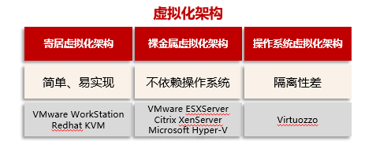
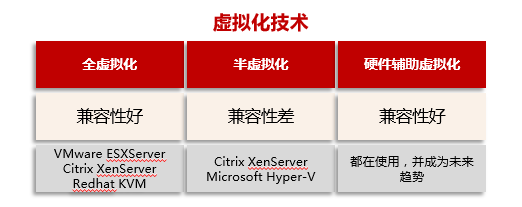
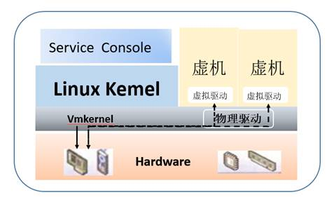
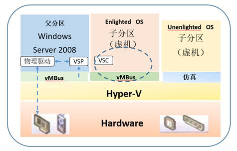
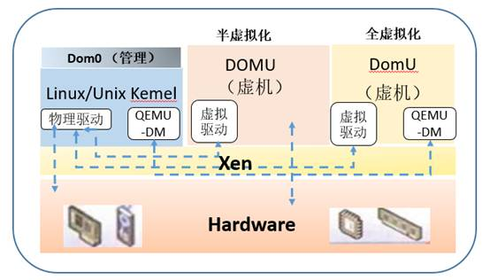
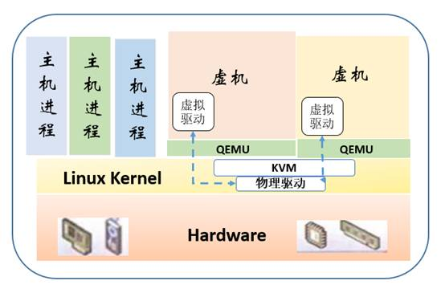

# 四大虚拟化架构对比

云计算如今已是一个相当热门的概念，以前每个人一台PC。现在大家共享一台超级PC，按需访问，不用时资源自动释放，可供其他用户使用，这样资源得以最大化利用，并且可以按需扩展，及时满足使用需求。

个人PC机的操作系统向下管理和驱动底层硬件，如CPU、内存、硬盘等，管理计算任务，调配资源， 向上为各类应用软件提供统一、标准的接口。

云操作系统功能有些类似，但功能更复杂。云操作系统它负责管理和调配一个或多个数据中心的硬件资源，这些资源可能由数量巨大的服务器、存储设备组成，并逻辑上把它们整合一台虚拟计算机系统，供上层云应用使用。

为了提升硬件资源使用效率，一台硬件设备会首先被虚拟成多个具备独立功能的虚拟设备，以便同时供多个应用调用，这就涉及到虚拟化技术，这也是云操作系统的关键技术之一。而当前具备这种虚拟化功能的技术维基百科列举的就有超过60种，其中有四种虚拟化技术是当前最为成熟而且运用最广泛的，分别是：VMware的ESX、微软Hyper-V、开源的Xen和KVM等，下面将针对这4种虚拟化技术架构进行分析。

从虚拟化的实现方式来看，虚拟化架构主要有三种形式：寄居虚拟化架构、裸金属虚拟化架构和操作系统虚拟化架构，其性能及主流产品如下：

以虚拟化架构维度，分类如下：
- 寄居虚拟化架构：Hypervisor运行在基础操作系统上，构建出一整套虚拟硬件平台，支持创建各种操作系统类型虚拟机。代表性产品：VMware WorkStation、Redhat KVM。优点：简单、易实现。缺点：上层Guest OS的处理需要逐层转换，发送到底层进行处理，依赖于Host OS。
- 裸金属虚拟化架构：Hypervisor直接运行在硬件上，直接与硬件交互提升效率。代表性产品：VMware ESXServer、Citrix XenServer、Microsoft Hyper-V。优点：交互效率提升，不依赖操作系统。
- 操作系统虚拟化架构：隔离性差，最后一种不常用，虚拟机运行在传统操作系统上，创建一个独立的虚拟化实例（容器Container），指向底层托管操作系统，缺点是操作系统唯一，如果底层操作系统跑的是Windows，那么VPS/VE就都得跑Windows。

在宿主架构中的虚拟机作为主机操作系统的一个进程来调度和管理，裸金属架构下 则不存在主机操作系统，它是以Hypervisor直接运行在物理硬件之上，即使是有类似主机操作系统的父分区或Domain 0，也是作为裸金属架构下的虚拟机存在的。宿主架构通常用于个人PC上的虚拟化，如WindowsVirtual PC，VMware Workstation，Virtual Box，Qemu等，而裸金属架构通常用于服务器的虚拟化。

以虚拟化技术维度，分类如下：

- 全虚拟化：也称为原始虚拟化技术，运行在虚拟机上的操作系统通过Hypervisor来最终分享硬件，所以虚拟机发出的指令需经过Hypervisor捕获并处理。
- 半虚拟化：半虚拟化技术是后来才出现的技术，它就是在全虚拟化的基础上，把客户操作系统进行了修改，增加了一个专门的API，这个API可以将客户操作系统发出的指令进行最优化，即不需要Hypervisor耗费一定的资源进行翻译操作，因此Hypervisor的工作负担变得非常的小，因此整体的性能也有很大的提高。
- 硬盘辅助虚拟化：Hypervisor可以在部分功能上与硬件直接交互，提升性能。比如在CPU性能较差的网络IO方面与硬件直接交互。

## ESX虚拟化架构

ESX是VMware的企业级虚拟化产品，ESX服务器启动时，首先启动Linux Kernel，通过这个操作系统加载虚拟化组件，最重要的是ESX的Hypervisor组件，称之为VMkernel，VMkernel会从 Linux Kernel完全接管对硬件的控制权，而该Linux Kernel作为VMkernel的首个虚拟机，用于承载ESX的serviceConsole，实现本地的一些管理功能。

VMkernel负责为所承载的虚拟机调度所有的硬件资源，但不同类型的硬件会有些区别。

虚拟机对于CPU和内存资源是通过VMkernel直接访问，最大程度地减少了开销，CPU的直接访问得益于CPU硬件辅助虚拟化(Intel VT-x和AMD AMD-V，第一代虚拟化技术)，内存的直接访问得益于MMU(内存管理单元)硬件辅助虚拟化。

虚拟机对于I/O设备的访问则有多种方式，以网卡为例，有两种方式可供选择：一是利用I/O MMU硬件辅助虚拟化的VMDirectPath I/O，使得虚拟机可以直接访问硬件设备，从而减少对CPU的开销；二是利用半虚拟化的设备VMXNETx，网卡的物理驱动在VMkernel中，在虚拟机中装载网卡的虚拟驱动，通过这二者的配对来访问网卡，与仿真式网卡相比有着较高的效率。半虚拟化设备的安装是由虚拟机中 VMware tool来实现的，可以在Windows虚拟机的右下角找到它。网卡的这两种方式，前者有着显著的先进性，但后者用得更为普遍，因为 VMDirectPath I/O与VMware虚拟化的一些核心功能不兼容，如：热迁移、快照、容错、内存过量使用等。

ESX的物理驱动是内置在Hypervisor中，所有设备驱动均是由VMware预植入的。因此，ESX对硬件有严格的兼容性列表，不在列表中的硬件，ESX将拒绝在其上面安装。

## Hyper-V虚拟化架构

Hyper-V是微软新一代的服务器虚拟化技术，首个版本于2008年7月发布，Hyper-V有两种发布版本：一是独立版，如Hyper-V Server 2008，以命令行界面实现操作控制，是一个免费的版本；二是内嵌版，如Windows Server 2008，Hyper-V作为一个可选开启的角色。

对于一台没有开启Hyper-V角色的Windows Server 2008来说，这个操作系统将直接操作硬件设备，一旦在其中开启了Hyper-V角色，系统会要求重新启动服务器。在这次重启动过程中，Hyper-V的Hypervisor接管了硬件设备的控制权，先前的Windows Server 2008则成为Hyper-V的首个虚拟机，称之为父分区，负责其他虚拟机(称为子分区)以及I/O设备的管理。Hyper-V要求CPU必须具备硬件辅助虚拟化，但对MMU硬件辅助虚拟化则是一个增强选项。

其实Hypervisor仅实现了CPU的调度和内存的分配，而父分区控制着I/O设备，它通过物理驱动直接访问网卡、存储等。子分区要访问I/O设备需要通过子分区操作系统内的VSC(虚拟化服务客户端)，对VSC的请求由VMBUS（虚拟机总线）传递到父分区操作系统内的VSP(虚拟化服务提供者)，再由VSP重定向到父分区内的物理驱动，每种I/O设备均有各自的VSC和VSP配对，如存储、网络、视频和输入设备等，整个I/O设备访问过程对于子分区的操作系统是透明的。其实在子分区操作系统内，VSC和VMBUS就是作为I/O设备的虚拟驱动，它是子分区操作系统首次启动时由Hyper-V 提供的集成服务包安装，这也算是一种半虚拟化的设备，使得虚拟机与物理I/O设备无关。如果子分区的操作系统没有安装Hyper-V集成服务包或者不支持 Hyper-V集成服务包(对于这种操作系统，微软称之为Unenlightened OS，如未经认证支持的Linux版本和旧的Windows版本)，则这个子分区只能运行在仿真状态。其实微软所宣称的启蒙式 (Enlightenment)操作系统，就是支持半虚拟化驱动的操作系统。

Hyper-V的Hypervisor是一个非常精简的软件层，不包含任何物理驱动，物理服务器的设备驱动均是驻留在父分区的Windows Server 2008中，驱动程序的安装和加载方式与传统Windows系统没有任何区别。因此，只要是Windows支持的硬件，也都能被Hyper-V所兼容。

## Xen虚拟化架构

XEN最初是剑桥大学Xensource的一个开源研究项目，2003年9月发布了首个版本XEN 1.0，2007年Xensource被Citrix公司收购，开源XEN转由www.xen.org继续推进，该组织成员包括个人和公司(如 Citrix、Oracle等)。该组织在2011年3月发布了版本XEN 4.1。

相对于ESX和Hyper-V来说，XEN支持更广泛的CPU架构，前两者只支持CISC的X86/X86_64 CPU架构，XEN除此之外还支持RISC CPU架构，如IA64、ARM等。

XEN的Hypervisor是服务器经过BIOS启动之后载入的首个程序，然后启动一个具有特定权限的虚拟机，称之为Domain 0(简称Dom 0)。Dom 0的操作系统可以是Linux或Unix，Domain 0实现对Hypervisor控制和管理功能。在所承载的虚拟机中，Dom 0是唯一可以直接访问物理硬件(如存储和网卡)的虚拟机，它通过本身加载的物理驱动，为其它虚拟机(Domain U，简称DomU)提供访问存储和网卡的桥梁。

XEN支持两种类型的虚拟机，一类是半虚拟化(PV，Paravirtualization)，另一类是全虚拟化(XEN称其为 HVM，Hardware Virtual Machine)。半虚拟化需要特定内核的操作系统，如基于Linux paravirt_ops(Linux内核的一套编译选项)框架的Linux内核，而Windows操作系统由于其封闭性则不能被XEN的半虚拟化所支持，XEN的半虚拟化有个特别之处就是不要求CPU具备硬件辅助虚拟化，这非常适用于2007年之前的旧服务器虚拟化改造。全虚拟化支持原生的操作系统， 特别是针对Windows这类操作系统，XEN的全虚拟化要求CPU具备硬件辅助虚拟化，它修改的Qemu仿真所有硬件，包括：BIOS、IDE控制器、 VGA显示卡、USB控制器和网卡等。为了提升I/O性能，全虚拟化特别针对磁盘和网卡采用半虚拟化设备来代替仿真设备，这些设备驱动称之为PV on HVM，为了使PV on HVM有最佳性能。CPU应具备MMU硬件辅助虚拟化。

XEN的Hypervisor层非常薄，少于15万行的代码量，不包含任何物理设备驱动，这一点与Hyper-V是非常类似的，物理设备的驱动均是驻留在Dom 0中，可以重用现有的Linux设备驱动程序。因此，XEN对硬件兼容性也是非常广泛的，Linux支持的，它就支持。

## KVM虚拟化架构

KVM的全称是Kernel-based Virtual Machine，字面意思是基于内核虚拟机。其最初是由Qumranet公司开发的一个开源项目，2008年，Qumranet被RedHat所收购，但KVM本身仍是一个开源项目，由RedHat、IBM等厂商支持。

与XEN类似，KVM支持广泛的CPU架构，除了X86/X86_64 CPU架构之外，还将会支持大型机(S/390)、小型机(PowerPC、IA64)及ARM等。

KVM充分利用了CPU的硬件辅助虚拟化能力，并重用了Linux内核的诸多功能，使得KVM本身是非常瘦小的，KVM的创始者Avi Kivity声称KVM模块仅有约10000行代码，但我们不能认为KVM的Hypervisor就是这个代码量，因为从严格意义来说，KVM本身并不是 Hypervisor，它仅是Linux内核中的一个可装载模块，其功能是将Linux内核转换成一个裸金属的Hypervisor。

通过KVM模块的加载将Linux内核转变成Hypervisor，KVM在Linux内核的用户(User)模式和内核(Kernel)模式基础上增加了客户(Guest)模式。Linux本身运行于内核模式，主机进程运行于用户模式，虚拟机则运行于客户模式，使得转变后的Linux内核可以将主机进程和虚拟机进行统一的管理和调度，这也是KVM名称的由来。

KVM 用来模拟 CPU 的运行，但缺少了对 Network 和 I/O 的支持。QEMU-KVM 是一个完整的模拟器，它基于 KVM 上，提供了完整的 Network 和 I/O 支持。其中 Openstack 为了跨 VM 性，所以不会直接控制 QEMU-KVM，而是通过 libvit 的库去间接控制 QEMU-KVM 。

KVM利用修改的QEMU提供BIOS、显卡、网络、磁盘控制器等的仿真，但对于I/O设备(主要指网卡和磁盘控制器)来说，则必然带来性能低下的问题。因此，KVM也引入了半虚拟化的设备驱动，通过虚拟机操作系统中的虚拟驱动与主机Linux内核中的物理驱动相配合，提供近似原生设备的性能。从此可 以看出，KVM支持的物理设备也即是Linux所支持的物理设备。

