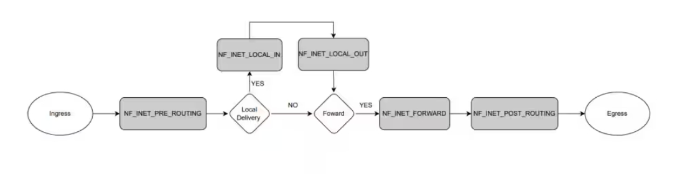
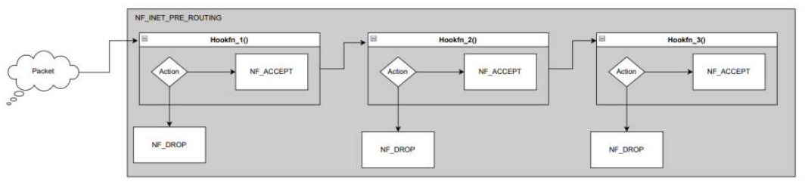

# Netfilter介绍

Netfilter是Linux 2.4内核中引入的一个子系统，它提供了一个框架，用于实现高级网络功能，如数据包过滤、网络地址转换（NAT）和连接跟踪。它通过利用内核网络代码中的钩子实现这一功能，这些钩子是内核代码可以注册函数以在特定网络事件发生时调用的位置。例如，当接收到一个数据包时，它会触发该事件的处理程序并执行模块指定的操作。

## 框架产生的背景

netfilter 框架为在 Linux 内核中拦截和操纵网络数据包提供了强大的机制。该框架由两个部分组成：Netfilter 钩子和 conntrack。在本博客中，我们将主要讨论 netfilter 钩子。虽然不同协议有不同的 Netfilter 钩子，但在本博客中，我们将集中讨论 IPv4 netfilter 钩子。

## Netfilter 钩子(Hooks)

Netfilter 钩子是注册到内核中，在网络堆栈的特定点被调用的函数。这些钩子可以被视为网络堆栈不同层中的检查点。它们允许内核模块实现自定义防火墙规则、网络地址转换、数据包过滤、日志记录等功能。预定义的执行过滤和日志记录等任务的函数可以热插拔到内核中，这使得它们更易于使用。

Netfilter 预定义了五个钩子点：
- NF_IP_PRE_ROUTING: 注册到此钩子的回调函数将在数据包进入网络堆栈后不久，由任何入站流量触发。此钩子在做出任何路由决策之前被处理，即在决定将数据包发送到哪个接口或本地进程之前。路由代码可能会丢弃无法路由的数据包。
- NF_IP_LOCAL_IN: 注册到此钩子的回调会在传入数据包被路由且数据包的目的地是本地系统后触发。
- NF_IP_FORWARD: 注册到此钩子的回调会在传入数据包已被路由且数据包将被转发到另一台主机后触发。
- NF_IP_LOCAL_OUT: 注册到此钩子的回调函数会在任何本地生成的出站流量进入网络堆栈时被触发。
- NF_IP_POST_ROUTING: 注册到此钩子的回调函数会在路由完成后、数据包实际发送到网络之前，由任何出站或转发流量触发。

每个钩点对应于数据包处理的不同阶段，如下图所示：



当数据包到达或离开网络接口时，它会依次经过这些钩子点。在每个钩子点，内核会调用该钩子点上所有已注册的netfilter钩子函数。每个netfilter钩子函数可以检查数据包并决定如何处理它。可能的操作包括：

- 接受(Accept)：数据包被允许继续传输到下一个钩子点或目的地。
- 丢弃(Drop)：数据包被静默丢弃，不再进行进一步处理。
- 队列(Queue)：数据包被放入队列，由如iptables或nftables等守护进程进行用户空间处理。
- 重复(Repeat)：数据包在同一钩点重新注入，进行另一轮处理。
- 停止(Stop)：数据包被接受，不再进行进一步处理。

## Netfilter APIs

需要调用 `nf_register_net_hook()` 函数，传入一个指向网络结构体（通常为 `&init_net`）的指针以及一个指向 `nf_hook_ops` 结构体的指针。这将向内核注册网络过滤器钩子函数并使其生效。

要取消注册一个 netfilter 钩子函数，需要调用 `nf_unregister_net_hook()` 并传入相同的参数。

可以将多个回调函数附加到同一个钩子上，并根据需求执行不同的操作。让我们尝试可视化一下这是什么样子。



## 内核代码分析: NF Hooks

要理解内核中这些 netfilter 钩子的代码流程，让我们以 `NF_INET_PRE_ROUTING` 钩子为例进行说明。

当接收到一个 IPv4 数据包时，其处理函数 `ip_rcv` 将按以下方式触发(代码摘自 Linux 内核中的 `net/ipv4/input.c` 文件)：

```c
/*
* IP receive entry point
*/
int ip_rcv(struct sk_buff *skb, struct net_device *dev, struct packet_type *pt, \
        struct net_device *orig_dev)
{
    struct net *net = dev_net(dev);

    skb = ip_rcv_core(skb, net);
    if (skb == NULL) {
        return NET_RX_DROP;
    }

    return NF_HOOK(NFPROTO_IPV4, NF_INET_PRE_ROUTING, net, NULL, skb, dev, NULL, ip_rcv_finish);
}
```

在此处理函数中，您可以看到钩子被传递给函数 `NF_HOOK`。现在这会触发附加到 `NF_INET_PRE_ROUTING` 的钩子函数，一旦它们全部返回，则会调用 `ip_rcv_finish`，而 `ip_rcv_finish` 又是 `NF_HOOK` 回调的参数(include/linux/netfilter.h)。

```c
static inline int NF_HOOK(uint8_t pf, unsigned int hook, struct net *net, struct sock *sk, 
        struct sk_buff *skb, struct net_device *in, struct net_device *out, 
        int (*okfn)(struct net *, struct sock *, struct sk_buff *))
{
    int ret = nf_hook(pf, hook, net, sk, skb, in, out, okfn);

    if (ret == 1) {
        ret = okfn(net, sk, skb);
    }
    return ret;
}
```

如果钩子允许数据包通过，则返回 1。在此情况下，调用方必须调用 okfn 函数。任何其他返回值均表示数据包已被钩子消耗。

## 实现一个 Netfilter 模块

现在我们已经明确了netfilter钩子的概念。接下来，让我们了解如何利用这些钩子在网络堆栈中对数据包进行简单的日志记录操作。要将回调函数热插拔到这些钩子中，用户需要编写一个内核模块，该模块定义并注册一个或多个netfilter钩子函数。

> 源码参看：include/linux/netfilter.h

1. netfilter 钩子函数的原型如下：
    ```c
    unsigned int nf_hookfn(void *priv, struct sk_buff *skb, const struct nf_hook_state *state);
    ```
    参数如下：
        - priv: 在注册钩子函数时传递的指向私有数据的指针。
        - skb: 指向网络数据包的指针，该数据包以 sk_buff 结构形式存储。
        - state: 指向 nf_hook_state 结构的指针，该结构包含关于钩子点的信息，例如网络协议、网络接口和路由信息。
    返回值是前一节中提到的可能操作之一。
2. 使用 nf_register_net_hook 函数注册一个 netfilter 钩子函数
    ```c
    int nf_register_net_hook(struct net *net, const struct nf_hook_ops *reg);
    ```
    struct nf_hook_ops 定义如下：
    ```c
    struct nf_hook_ops {
        /* User fills in from here down. */
        nf_hookfn *hook;
        struct net_device *dev;
        void *priv;
        u_int8_t pf;
        unsigned int hooknum;
        /* Hooks are ordered in ascending priority. */
        int priority;
    };
    ```
    各个字段含义如下：
        - pf: 要拦截的数据包的协议族，例如用于IPv4的PF_INET或用于IPv6的PF_INET6。
        - hooknum: 函数应被调用的钩子点，例如 NF_INET_PRE_ROUTING 或 NF_INET_LOCAL_OUT。
        - priority: 同一钩子点内函数的优先级。数值越低，优先级越高。
        - hook: 指向 netfilter 钩子函数的指针。
        - priv: 指向将传递给钩子函数的私有数据的指针。
3. 初始化 nf_hooks_ops 结构体
    ```c
    static struct nf_hook_ops *nf_tracer_ops = NULL;

    static unsigned int nf_tracer_handler(void *priv, struct sk_buff *skb, \
                const struct nf_hook_state *state);
    static int __init nf_tracer_init(void) 
    {
        nf_tracer_ops = \
            (struct nf_hook_ops*)kcalloc(1, sizeof(struct nf_hook_ops), GFP_KERNEL);

        if(nf_tracer_ops!=NULL) {
            nf_tracer_ops->hook = (nf_hookfn*)nf_tracer_handler;
            nf_tracer_ops->hooknum = NF_INET_PRE_ROUTING;
            nf_tracer_ops->pf = NFPROTO_IPV4;
            nf_tracer_ops->priority = NF_IP_PRI_FIRST;

            nf_register_net_hook(&init_net, nf_tracer_ops);
        }
        return 0;
    }
    module_init(nf_tracer_init);
    ```
4. 注销netfilter hook
    ```c
    static void __exit nf_tracer_exit(void) 
    {
        if(nf_tracer_ops != NULL) {
            nf_unregister_net_hook(&init_net, nf_tracer_ops);
            kfree(nf_tracer_ops);
        }
    }
    module_exit(nf_tracer_exit);
    ```
完整代码如下：
```c
#include <linux/module.h>
#include <linux/kernel.h>
#include <linux/netfilter.h>
#include <linux/netfilter_ipv4.h>
#include <linux/ip.h>
#include <linux/tcp.h>
#include <linux/udp.h>
#include <linux/string.h>
#include <linux/byteorder/generic.h>

static struct nf_hook_ops *nf_tracer_ops = NULL;
static struct nf_hook_ops *nf_tracer_out_ops = NULL;

static unsigned int nf_tracer_handler(void *priv, struct sk_buff *skb, 
            const struct nf_hook_state *state) 
{
    if(skb==NULL) {
        return NF_ACCEPT;
    }

    struct iphdr * iph;
    iph = ip_hdr(skb);

    if(iph && iph->protocol == IPPROTO_TCP) {
        struct tcphdr *tcph = tcp_hdr(skb);

        pr_info("source : %pI4:%hu \
                | dest : %pI4:%hu \
                | seq : %u \
                | ack_seq : %u \
                | window : %hu \
                | csum : 0x%hx \
                | urg_ptr %hu\n", \
                &(iph->saddr), \
                ntohs(tcph->source), \
                &(iph->saddr), \
                ntohs(tcph->dest), \
                ntohl(tcph->seq), \
                ntohl(tcph->ack_seq), \
                ntohs(tcph->window), \
                ntohs(tcph->check), \
                ntohs(tcph->urg_ptr));
    }

    return NF_ACCEPT;
}


static int __init nf_tracer_init(void) 
{
    nf_tracer_ops = (struct nf_hook_ops*)kcalloc(1,  sizeof(struct nf_hook_ops), GFP_KERNEL);

    if(nf_tracer_ops!=NULL) {
        nf_tracer_ops->hook = (nf_hookfn*)nf_tracer_handler;
        nf_tracer_ops->hooknum = NF_INET_PRE_ROUTING;
        nf_tracer_ops->pf = NFPROTO_IPV4;
        nf_tracer_ops->priority = NF_IP_PRI_FIRST;

        nf_register_net_hook(&init_net, nf_tracer_ops);
    }

    nf_tracer_out_ops = (struct nf_hook_ops*)kcalloc(1, sizeof(struct nf_hook_ops), GFP_KERNEL);

    if(nf_tracer_out_ops!=NULL) {
        nf_tracer_out_ops->hook = (nf_hookfn*)nf_tracer_handler;
        nf_tracer_out_ops->hooknum = NF_INET_LOCAL_OUT;
        nf_tracer_out_ops->pf = NFPROTO_IPV4;
        nf_tracer_out_ops->priority = NF_IP_PRI_FIRST;

        nf_register_net_hook(&init_net, nf_tracer_out_ops);
    }

    return 0;
}

static void __exit nf_tracer_exit(void) 
{
    if(nf_tracer_ops != NULL) {
        nf_unregister_net_hook(&init_net, nf_tracer_ops);
        kfree(nf_tracer_ops);
    }

    if(nf_tracer_out_ops != NULL) {
        nf_unregister_net_hook(&init_net, nf_tracer_out_ops);
        kfree(nf_tracer_out_ops);
    }
}

module_init(nf_tracer_init);
module_exit(nf_tracer_exit);

MODULE_LICENSE("GPL");
```

## 参看内核代码

- Kernel code - 5.4.17-2136.328.3.el8uek.x86_64 net/ipv4/ip_input.c
- Kernel code - 5.4.17-2136.328.3.el8uek.x86_64 include/linux/netfilter.h
